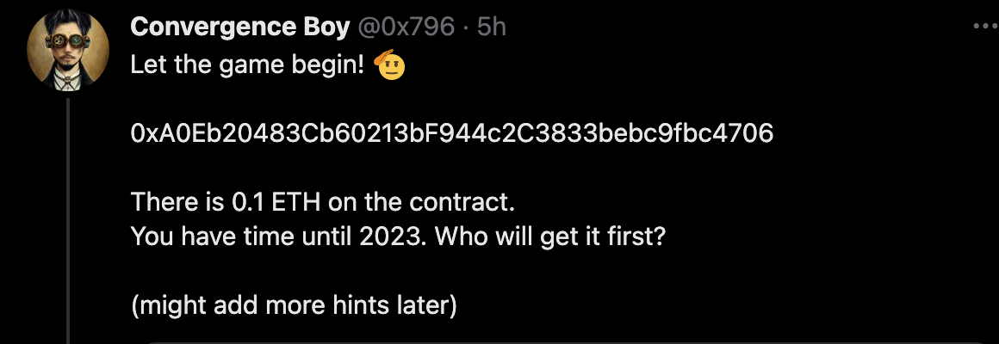

### 1. Introduction

The _29 December 2022_ a challenge went public on [Twitter](https://twitter.com/0x796/status/1608553575969611777?s=20&t=dInafmHAmrYRQZWL2KnQug), it was the evening and what to do after a day of full of auditing solidity contract? _Eat,Sleep,Audit,Repeat?_



The goal of the challenge is to steal the **0.1 ETH** that are waiting on the vulnerable contract.

Let's dive into the challenge.. Obviously, the contract is <u>_not verified_</u> so we have to dive into the _bytecode_ time to use **decompilers** lads!


Here, we have to **go fast** because the challenge is public so first come first serve... In addition, The contract size seems to be _small_. \
Let’s use [dedaub](https://library.dedaub.com/contracts/Ethereum/0xA0Eb20483Cb60213bF944c2C3833bebc9fbc4706/overview) this time (even if [heimdall](https://github.com/Jon-Becker/heimdall-rs) looks really promising).

After using the debugger, we have the following code decompiled:

```solidity
function __function_selector__() public payable {
    v0 = BASEFEE();
    if (msg.value) {
        require(msg.value > 'iiiii' * (0x63b0beef - block.timestamp)RETURNDATASIZE(), RETURNDATASIZE());
        STORAGE[msg.sender] = 4095 + block.timestamp;
        return MEM[(RETURNDATASIZE()) len (RETURNDATASIZE())];
    }
		else {
        require((block.timestamp > STORAGE[msg.sender]) & (RETURNDATASIZE() < STORAGE[msg.sender])RETURNDATASIZE(), RETURNDATASIZE());
        MEM[0] = (msg.data.length << 232) + 0x61000080600a3d393df300000000000000000000000000000000000000000000;
        CALLDATACOPY(10, RETURNDATASIZE(), msg.data.length);
        v1 = v2 = 1 + (msg.data.length - 1 >> 5);
        do {
            MEM[10 + (v2 - v1 << 5)] = (msg.sender | msg.sender << 160) ^ MEM[10 + (v2 - v1 << 5)];
            v1 = v1 - 1;
        } while (!v1);
        v3 = create.code(RETURNDATASIZE(), msg.data.length + 10).value(RETURNDATASIZE());
    [1] v4 = v3.delegatecall(MEM[(RETURNDATASIZE()) len (RETURNDATASIZE())], MEM[(RETURNDATASIZE()) len (RETURNDATASIZE())]).gas(msg.gas);
        return MEM[(RETURNDATASIZE()) len (RETURNDATASIZE())];
  }
}
```


Inside the contract we don't have any `transfer()`, or `.call()`. But, since we got a `delegatecall()` at the end of the code we probably need to call it.


So we need to somehow find a way to trigger the `delegatecall()` on the address ➙ <u>**v3**</u> with a EVM bytecode that permits to execute what we wants _here will be to empty the contract!_.

If we are looking closely to the address <u>**v3**</u>, we can see that a contract is created and deployed from the the _memory_ of the contract.

```solidity
v3 = create.code(RETURNDATASIZE(), msg.data.length + 10).value(RETURNDATASIZE());

```

_Hmmm.. time to make put some malicious bytecode into this memory to create and deployed our malicious contract!_

So we probably need to figure out, how could we manage to deploy a malicious evm bytecode to steal the 0.1 ETH. Have to remember the famous 10M bounty from wormhole here ➙ [Wormhole Uninitialized Proxy Bugfix Review](https://medium.com/immunefi/wormhole-uninitialized-proxy-bugfix-review-90250c41a43a))

---

### 2. Conditions bypass

So for now we need to bypass the first `require()` .

```solidity
require((block.timestamp > STORAGE[msg.sender]) & (RETURNDATASIZE() < STORAGE[msg.sender])RETURNDATASIZE(), RETURNDATASIZE());
```

For this, we just need to have the `storage[msg.sender] > returndatasize()` which will always be **0** in our case for the `returndatasize()`


Here `returndatasize()` will return always 0 and will be cheaper in gas than a classic push 👀



Then, we need to have to bypass the following check:

```solidity
block.timestamp > STORAGE[msg.sender])
```

To do, so we need to find a way to write at `STORAGE[msg.sender].` Hopefully for us, we have the following the code:

```solidity
if (msg.value) {
        require(msg.value > 'iiiii' * (0x63b0beef - block.timestamp)RETURNDATASIZE(), RETURNDATASIZE());
        STORAGE[msg.sender] = 4095 + block.timestamp;
        return MEM[(RETURNDATASIZE()) len (RETURNDATASIZE())];
    }
```

If the `msg.value > 0` is `true` then the contract will overwrite the value `STORAGE[msg.sender]` with the `block.timestamp + 4095`

So, here we know we will have to make <u>_two calls_</u>:

1. Setup the value into the storage to bypass the `require()` using a `msg.value > 0`.
2. Then recall the contract with `msg.value == 0` to execute the `delegatecall()`.

However, if we are looking closely the :

```solidity
STORAGE_[msg.sender] = 4095 + block.timestamp;
```

but the check later on, compares:

```solidity
block.timestamp > STORAGE[msg.sender]
```

At that point, we got a problem because `4095+block.timestamp` will be greater than `block.timestamp`.

```solidity
STORAGE_[msg.sender] = 4095+block.timestamp;
```

This will be really awfull... As the `block.timestamp` will not change during the same transaction...

How could we **bypass** this check? \
_Patience... we have to wait 4095 seconds before calling again the contract._

Obviously, for _debugging purposes_ we can use cheatcode from [Foundry](https://github.com/foundry-rs/foundry) like <u>vm.warp()</u>: `vm.warp(4096+block.timestamp)`to jump in the future of **<u>4096 seconds</u>**.

---

### 3. Bytecode

We are now bypassing everything! We arriving at the interesting part. henceforth we need to craft our malicious contract to steal the _ETH_ during the `delegateCall()`.

The "base" of the evm bytecode is already made for us here:

```solidity

MEM[0] = (msg.data.length << 232) + 0x61000080600a3d393df300000000000000000000000000000000000000000000;
//The "base" evm is then : 0x61000080600a3d393df300000000000000000000000000000000000000000000
```

We got the _0xF3_ at the end (stands for <u>RETURN</u>), so if somehow we succeed to inject the malicious bytecode after the 0xf3(RETURN).\
_We will be rich as yannickcrypto.eth!🚀_

The `msg.data` is used to determine the length of our contract code. So for example, if the length is **30** bytes the contract deployed will be of **30** bytes.

So just to recap, we have to use the `msg.data`. To use it, we will use a _bytes memory_ using the `hex` keyword (e.g below).

```solidity
bytes memory data = hex"4141414141414141414141414141414141414141"; // send 20 bytes.
victim.call{ gas: 1_000_000 }(data);
```

So this the layout we have right now:

```solidity
	20 bytes (Base)
|------------------|
61000080600a3d393df300000000000000000000000000000000000000000000
                   ^
```

This is the layout we want:

```solidity
   20 bytes (Base)    bytes malicious to create a selfdestruct
|------------------|-------------------------------------------|
61000080600a3d393df300000000000000000000000000000000000000000000
                   ^
```

The _`CALLDATACOPY`_ is used to **copy** the data into the memory here (all the data is copied).


So this will copy the data to the offset **10**. (e.g : screenshots & explanation below).

- Before `CALLDATACOPY` this is what looks like the memory.


- After `CALLDATACOPY` here the <u>size</u> is 0x20 because the [real payload](https://www.notion.so/TwitterChallenge-Puzzle-ByteCode-f31ba85c800f4c42a469490f9c2378c0) is **32** bytes (0x20 = 32).


Now, we have to dive into the weird math operation… Here, I was confused with the output of the decompiler. But lucky for me, I was already familiar with this kind of <u>xor pattern</u> → [Reversing & crackme on x86 (PleaseSubscribe)](https://www.youtube.com/watch?v=FaxLEwj4fW8).

```solidity
v1 = v2 = 1 + (msg.data.length - 1 >> 5);
        do {
            MEM[10 + (v2 - v1 << 5)] = (msg.sender | msg.sender << 160) ^ MEM[10 + (v2 - v1 << 5)];
            v1 = v1 - 1;
        } while (!v1);
```

So I guessed it.. was a <u>xor byte per byte operation</u> by the pattern. We will use the _foundry debugger_ to confirm.

First, we need to generate some values to prove it.

Let’s use python here:


Now, we can add the value using the `hex` as previous.

```solidity
bytes memory data = hex"4141414141414141414141414141414141414141414141414141414141414141"; // hexadecimal string
victim.call{ gas: 1_000_000 }(data);
```
And now, if we move to the <u>xor operation</u> with the _foundry debugger_.


This is the case!!And now, we need to use the right opcodes to not revert and execute a full self-destruct on our address to getback the ETH 

### 4. SELFDESTRUCT

`SELFDESTRUCT` will destroy and send **all** the *ETH* to a **arbitrary** address.

The `SELFDESTRUCT` opcode is `0xFF`.



Let’s use [evm.codes](http://evm.codes) to know how to use `SELFDESTRUCT` ⬇️


So our plan, will be : \
1 -  `PUSH` our address on the <u>stack</u>.

2 -  Call the `SELFDESTRUCT`.

3 - Call `STOP` to stop the execution?

Ok, we need to push our address using `PUSH20` for 20 bytes (because addresses are in **uint160**).

So, it will looks like something like:


```solidity
PUSH20(0x5b73c5498c1e3b4dba84de0f1833c4a029d90519)   | 0xF3
SELFDESTRUCT()                                       | 0xFF
STOP                                                 | 0x00
```

The final payload is:

```solidity
735b73c5498c1e3b4dba84de0f1833c4a029d90519FF00
```


Now we have the payload we need to make win the challenge! 
However, we have to reminder the xor operation!
So using python one last time we can xor our payload with the key.
```python
>>> hex(0xba84de0f1833c4a029d905195b73c5498c1e3b4dba84de ^ 0x735b73c5498c1e3b4dba84de0f1833c4a029d90519FF00)
'0xc9dfadca51bfda9b646381c7546bf68d2c37e248a37bde'
```

And we got our **final payload**!!! `0xc9dfadca51bfda9b646381c7546bf68d2c37e248a37bde`
Let's execute this one into on ETH mainnet!

### 5. Proof of Concept & Results
```bash
Traces:
  [112757] CounterScript::run()
    ├─ [0] VM::deal(CounterScript: [0x5b73C5498c1E3b4dbA84de0F1833c4a029d90519], 1000000000000000000)
    │   └─ ← ()
    ├─ emit log_string(:  ----------------------- Before Attack ----------------------------------)
    ├─ emit log_named_uint(key: Balance of the contract, val: 1000000000000000000)
    ├─ emit log_named_uint(key: Balance of the victim, val: 100000000000000000)
    ├─ [22173] 0xA0Eb20483Cb60213bF944c2C3833bebc9fbc4706::fallback{value: 100000000000000000}()
    │   └─ ← ()
    ├─ [0] VM::warp(1672353711)
    │   └─ ← ()
    ├─ [43904] 0xA0Eb20483Cb60213bF944c2C3833bebc9fbc4706::c9dfadca(51bfda9b646381c7546bf68d2c37e248a37bde0f1833c4a029d90519)
    │   ├─ [6422] → new <Unknown>@0x37a9B80AcC6A434d4E29D8873BaB9E471cb0d244
    │   │   └─ ← 32 bytes of code
    │   ├─ [5003] 0x37a9B80AcC6A434d4E29D8873BaB9E471cb0d244::fallback() [delegatecall]
    │   │   └─ ← ()
    │   └─ ← ()
    ├─ emit log_string(:  ----------------------- After Attack ----------------------------------)
    ├─ emit log_named_uint(key: Balance of the contract, val: 1100000000000000000)
    ├─ emit log_named_uint(key: Balance of the victim, val: 0)
    └─ ← ()

Script ran successfully.

== Logs ==
   ----------------------- Before Attack ----------------------------------
  Balance of the contract: 1000000000000000000
  Balance of the victim: 100000000000000000
   ----------------------- After Attack ----------------------------------
  Balance of the victim: 0
```

Voila! The victim contract is now holding **0 ETH**! We drained all the eth from the contract :) 


Don’t hesitate to join us on discord, we are building a InfoSec web3 community 🔥 with CTFs.

### 6. Socials & Payload

| Discord (Join us!) | Github | Twitter | 
| ----------------------------- | ------ | ---------- | 
| https://discord.gg/54Q9pnpQcV |  https://github.com/Ethnical/Swek3      |  https://twitter.com/EthnicalInfo |

```solidity
The payload used not _clean (yet)_:

```solidity
// SPDX-License-Identifier: UNLICENSED
pragma solidity ^0.8.13;

import "forge-std/Script.sol";
import "forge-std/Test.sol";

contract CounterScript is Script, Test {
	function setUp() public {}

	function run() public {
		vm.deal(address(this), 1 ether);
		address victim = 0xA0Eb20483Cb60213bF944c2C3833bebc9fbc4706;
		string memory victim_addr = "";
		emit log_string(" ----------------------- Before Attack ----------------------------------");
		emit log_named_uint("Balance of the contract", address(this).balance);
		emit log_named_uint("Balance of the victim", address(victim).balance);
		bytes memory data = hex"c9dfadca51bfda9b646381c7546bf68d2c37e248a37bde0f1833c4a029d90519"; // hexadecimal payload xored.


		victim.call{ value: 0.1 ether }("");
		vm.warp(block.timestamp + 10000);
		victim.call{ gas: 1_000_000 }(data);
		emit log_string(" ----------------------- After Attack ----------------------------------");
		emit log_named_uint("Balance of the contract", address(this).balance);
		emit log_named_uint("Balance of the victim", address(victim).balance);

	}
}
```

Challenge Code EVM codes for retrying the challenge!

```solidity
**0x4861707079204e65772059656172204576657279626f647921212121212121346100ab573354803d1090421116610034573d3dfd5b69414e65f7405358584fd360801b1860801c60b01b3660e81b016000525a600a3601363d600a373360a01b331760206001360304600101805b808203602002600a01805184189052600190038061006d575050503d3df03d808080936100a0566920434f4e475241545a205b636861645d95f43d3df35b426363b0beef036469696969690234116100c3573d3dfd5b42610fff0133553d3df3**
```
